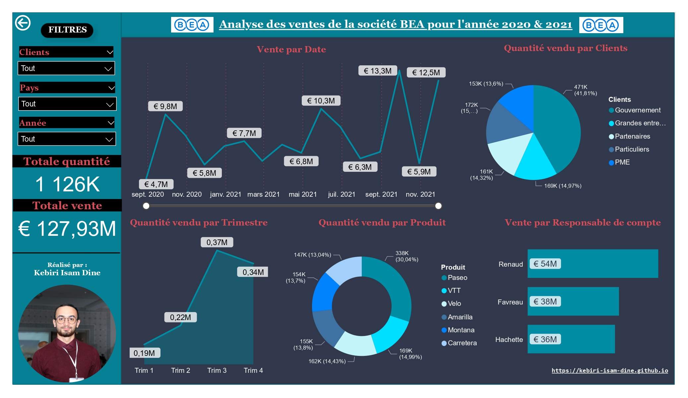

# Analyse des ventes de la société BEA

## About The Project

Analyse des ventes de la société BEA pour l'année 2020 & 2021 sur la base de deux fichiers Excel :

1. [commandes.xlsx](Data/commandes.xlsx) contient : Segment (clients), Pays, Produit, Rabais, Quantité, Prix de vente, Montant, Date et la relation entre les deux tables ID RC
2. [responsable_comptes.xlsx](Data/responsable%20comptes.xlsx) contient : Responsable de compte, adresse, email, téléphone et la relation entre les deux tables ID RC

#### Relations sortie :
- Vente par Date
- Quantité vendu par Clients
- Quantité vendu par Trimestre
- Quantité vendu par Produit
- Vente par Responsable de compte
- Totale quantité vendu
- Toatale des ventes en €

#### Filtres :
- Sur pays
- Sur Années (2020 ou 2021)
- sur Clients

#### Built With

* PowerBI

## Usage

Run [Analyse_ventes_BEA.pbix](Analyse_ventes_BEA.pbix)

## Résultat
[RESULT](Analyse_ventes_BEA.pdf)

## License

[GPL-3.0](https://choosealicense.com/licenses/gpl-3.0/)

## Contact

📫 How to reach me: kebiri.isam.dine@gmail.com

🌐 My Portfolio: <https://kebiri-isam-dine.github.io/>

🔗 Project Link: [https://github.com/Kebiri-isam-dine/Analyse_ventes_BEA](https://github.com/Kebiri-isam-dine/Analyse_ventes_BEA)
